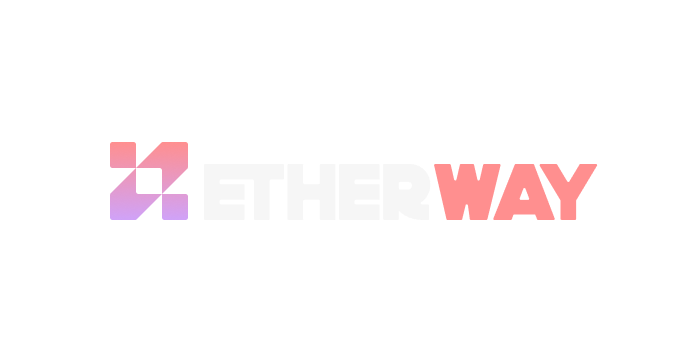

# **Etherway (CrossFarm)**

Live at: [https://www.etherway.io/](https://www.etherway.io/)

**Etherway** is a cross-chain platform designed specifically for airdrop farmers, enabling seamless cross-chain transactions, token swaps, and gas refueling across multiple mainnet chains. The platform supports major blockchain ecosystems and offers live performance tracking with a leaderboard for users to compete for rewards and earn incentives based on their interactions.

## 🌟 **Key Features**

- **Cross-Chain Transactions & Bridging**: Seamlessly execute cross-chain swaps and transfers across multiple blockchain networks, allowing easy participation in airdrops and multi-chain DeFi ecosystems. 

- **Live Leaderboard & Incentives**: Monitor your performance with a **live leaderboard** that ranks user interactions and activities. The platform features an **incentive system** that rewards users based on their engagement and cross-chain transactions, increasing rewards with higher activity.

- **LayerZero V2 Integration**: Leverages **LayerZero V2** to support **OFT (Omnichain Fungible Token) standard**, enabling secure and seamless cross-chain messaging. It also includes a **custom implementation of the ONFT (Omnichain Non-Fungible Token) standard** for NFTs, along with a **gas refuel** feature for simplifying gas management during cross-chain operations.

- **Hyperlane Integration**: Supports **ERC20** and **ERC721 tokens** for advanced interchain messaging and secure asset transfers, providing a streamlined experience for cross-chain interaction.

- **Axelar & Squid Cross-Chain Bridging**: Integrates **Axelar** and **Squid** to provide fast, reliable **cross-chain asset bridging**, facilitating effortless participation in multi-chain airdrop events and token transfers.

- **Gas Refuel**: Simplifies gas management by automatically refueling gas tokens, eliminating the need for native chain tokens to pay for fees when performing cross-chain transactions.

## 🔧 **Relevant Technologies**

**Etherway** is built using a suite of cutting-edge tools and technologies:

- **Blockchain SDKs & Tools**:  
  - **Squid SDK** for cross-chain swaps.
  - **LayerZero V2** utilities for cross-chain messaging.
  - **Axelar** for decentralized cross-chain transfers.
  - **Wagmi, Viem & Ethers.js** for blockchain interactions.

- **Frontend & UI**:  
  - **Next.js & TypeScript**: For fast, scalable frontend development with type safety.
  - **TailwindCSS & Shadcn-UI**: For responsive design and custom UI components.
  - **Radix UI**: For building accessible and modular UI components.

- **Authentication & State Management**:  
  - **SIWE (Sign-In with Ethereum)** for Web3 authentication.
  - **NextAuth** for session management.
  - **TanStack React Query** for state and data management.

- **Form Handling & Validation**:  
  - **React Hook Form** for simple and efficient form management.
  - **Zod** for schema validation.

- **Database & Optimization**:  
  - **Prisma** as the ORM for database interactions.
  - **Sharp** for image processing and optimization.

## 📈 **Live Leaderboard**

**Etherway** includes a **live leaderboard** to track and rank user engagement across the platform. Users are rewarded with leaderboard points based on their cross-chain interactions.

## 📃 **License**

This project is licensed under the [MIT License](LICENSE).
